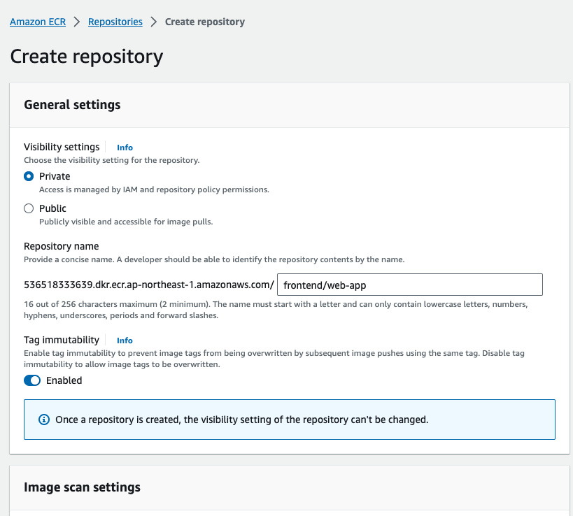

* [How To Serve React Application With NGINX and Docker](#how-to-serve-react-application-with-nginx-and-docker)
    * [Step 1: Create React App Using Vite (Skip this step if you already have a react app)](#step-1-create-react-app-using-vite-skip-this-step-if-you-already-have-a-reactapp)
    * [Step 2: Update vite.config File](#step-2-update-viteconfig-file)
    * [Step 3: Create a Dockerfile](#step-3-create-a-dockerfile)
    * [Step 4: Add Commands to Dockerfile](#step-4-add-commands-to-dockerfile)
    * [Step 5: Build the Dockerfile](#step-5-build-the-dockerfile)
    * [Step 6: Run the Docker Container](#step-6-run-the-docker-container)
    * [Step 7: Open the App in the Browser](#step-7-open-the-app-in-thebrowser)
* [AWS — Deploying React App With NGINX on EKS](#aws--deploying-react-app-with-nginx-on-eks)
  * [Pushing Docker Image To ECR](#pushing-docker-image-to-ecr)
    * [AWS console](#aws-console)
    * [Tagging your local Docker image and Pushing](#tagging-your-local-docker-image-and-pushing)
  * [Create a Cluster and Worker Nodes](#create-a-cluster-and-worker-nodes)
    * [Cluster Creation](#cluster-creation)
    * [Create Worker Nodes](#create-worker-nodes)
  * [Configure kubectl to use Cluster](#configure-kubectl-to-use-cluster)
  * [Deploy Kubernetes Objects On AWS EKS Cluster](#deploy-kubernetes-objects-on-aws-eks-cluster)
  * [Summary](#summary)

# How To Serve React Application With NGINX and Docker

Date Added: September 19, 2023 2:00 PM

<aside>
💡 This template documents how to review code. Helpful for new and remote employees to get and stay aligned.

</aside>

## **Step 1: Create React App Using Vite (Skip this step if you already have a react app)**

```bash
npm create vite@latest
```

You'll be asked for

- App Name
- Which Framework to use like React, Angular, or Vue? Choose React
- Then, Typescript or Javascript. Choose as you wish

Vite Project Initialization

Now switch to the project directory

```bash
cd [your project name]
```

## **Step 2: Update vite.config File**

This step is required to map the port between Docker container and your React app

Now replace this code snippet in `vite.config`

```jsx
export default defineConfig({
  plugins: [react()],
});

```

to

```jsx
export default defineConfig({
  plugins: [react()],
  server: {
    watch: {
      usePolling: true,
    },
    host: true, // needed for the Docker Container port mapping to work
    strictPort: true,
    port: 5173, // you can replace this port with any port
  }

```

## **Step 3: Create a Dockerfile**

Create a file called `Dockerfile` in the root of your project directory.

## **Step 4: Add Commands to Dockerfile**

Copy these commands to your Dockerfile

```docker
# Stage 0, "build-stage", based on Node.js, to build and compile the frontend
FROM tiangolo/node-frontend:10 as build-stage

WORKDIR /app

COPY package*.json /app/

RUN npm install

COPY ./ /app/

RUN npm run build

# Stage 1, based on Nginx, to have only the compiled app, ready for production with Nginx
FROM nginx:1.15

COPY --from=build-stage /app/build/ /usr/share/nginx/html

# Copy the default nginx.conf provided by tiangolo/node-frontend
COPY --from=build-stage /nginx.conf /etc/nginx/conf.d/default.conf
```

The explanation for these commands:

- This will tell Docker that we will start with a base image **node:10-alpine** which in turn is based on the [Node.js official image](https://hub.docker.com/_/node/), notice that you won’t have to install and configure Node.js inside the Linux container or anything, Docker does that for you:

```docker
FROM node:10-alpine as builder
```

- Our working directory will be `/react-nginx-docker`. This Docker "instruction" will create that directory and go inside of it, all the next steps will "be" in that directory:

```docker
WORKDIR /react-nginx-docker
```

- Now, this instruction copies all the files that start with `package` and end with `.json` from your source to inside the container. With the `package*.json` it will include the `package.json` file and also the `package-lock.json` if you have one, but it won't fail if you don't have it. Just that file (or those 2 files), before the rest of the source code, because we want to install everything the first time, but not every time we change our source code. The next time we change our code and build the image, Docker will use the cached "layers" with everything installed (because the `package.json`hasn't changed) and will only compile our source code:

```docker
COPY package.json package-lock.json ./
```

- Install all the dependencies, this will be cached until we change the `package.json` file (changing our dependencies). So it won't take very long installing everything every time we iterate in our source code and try to test (or deploy) the production Docker image, just the first time and when we update the dependencies (installed packages):

```docker
RUN npm install
```

- Now, after installing all the dependencies, we can copy our source code. This section will not be cached that much, because we’ll be changing our source code constantly, but we already took advantage of Docker caching for all the package install steps in the commands above. So, let’s copy our source code:

```docker
COPY . .
```

- Then build the React app with:

```docker
RUN npm run build
```

…that will build our app, to the directory `./build/`. Inside the container will be in `/app/build/`.

- In the same `Dockerfile` file, we start another section (another "stage"), like if 2 `Dockerfile`s were concatenated. That's Docker multi-stage building. It almost just looks like concatenating `Dockerfile`s. So, let's start with an [official Nginx base image](https://hub.docker.com/_/nginx/) for this "stage":

```docker
FROM nginx:alpine
```

…if you were very concerned about disk space (and you didn’t have any other image that probably shares the same base layers), or if, for some reason, you are a fan of Alpine Linux, you could change that line and use an [Alpine version](https://hub.docker.com/_/nginx/).

- Here’s the Docker multi-stage trick. This is a normal `COPY`, but it has a `-from=builder`. That `builder` refers to the name we specified above in the `as builder`. Here, although we are in a Nginx image, starting from scratch, we can copy files from a previous stage. So, we can copy the compiled fresh version of our app. That compiled version is based on the latest source code, and that latest compiled version only lives in the previous Docker "stage", for now. But we'll copy it to the Nginx directory, just as static files:

```docker
COPY --from=builder /react-nginx-docker/build /usr/share/nginx/html
```

- This configuration file directs everything to `index.html`, so that if you use a router like [React router](https://reacttraining.com/react-router/) it can take care of it's routes, even if your users type the URL directly in the browser:

```docker
COPY ./.nginx/nginx.conf /etc/nginx/nginx.conf
```

…that’s it for the `Dockerfile`! Doing that with scripts or any other method would be a lot more cumbersome.

## **Step 5: Build the Dockerfile**

Now we can build our image, doing it will compile everything and create a Nginx image ready for serving our app.

- Build your image and tag it with a name:

```bash
docker build -t react-nginx-docker .
```

## **Step 6: Run the Docker Container**

To check that your new Docker image is working, you can start a container based on it and see the results.

- To test your image start a container based on it:

```bash
docker run -p 80:80 react-nginx-docker
```

…you won’t see any logs, just your terminal hanging there.

- Open your browser in [http://localhost](http://localhost/).

## **Step 7: Open the App in the Browser**

Open the Browser and access `http://localhost:[Port you mentioned in the docker run command]` as per the configuration we did so far it should be `<http://localhost:8080>`

# AWS — Deploying React App With NGINX on EKS

Date Added: September 19, 2023 2:01 PM

<aside>
💡 This template documents how to review code. Helpful for new and remote employees to get and stay aligned.

</aside>

## **Pushing Docker Image To ECR**

Amazon Elastic Container Registry (ECR) is a fully-managed [Docker](https://aws.amazon.com/docker/) container registry that makes it easy for developers to store, manage, and deploy Docker container images. Amazon ECR is integrated with [Amazon Elastic Container Service (ECS)](https://aws.amazon.com/ecs/), simplifying your development to production workflow.

Amazon ECS works with any Docker registry such as Docker Hub, etc. But, in this post, we see how we can use Amazon ECR to store our Docker images. Once you set up the Amazon account and create an IAM user with Administrator access the first thing you need to create a Docker repository.

You can create your first repository either by AWS console or AWS CLI

### **AWS console**

Creating a repository with AWS console is straightforward and all you need to give a name.



**creating repository**


### **Tagging your local Docker image and Pushing**

Retrieve an authentication token and authenticate your Docker client to your registry

```bash
aws ecr get-login-password --region ap-northeast-1 | docker login --username AWS --password-stdin 536518333639.dkr.ecr.ap-northeast-1.amazonaws.com
```

You have created a Docker image on your local machine earlier. It’s time to tag that image with this repository URI in the above image.

```bash
docker tag react-nginx-ui:latest 536518333639.dkr.ecr.ap-northeast-1.amazonaws.com/frontend/web-app:v1
```

Once you tag the image and it’s time to push the Docker image into your repository.

```bash
// list the images
docker images
// push the image
docker push 536518333639.dkr.ecr.ap-northeast-1.amazonaws.com/frontend/web-app:v1
```

**Pushing Docker image**


**Docker image with tag v1**


## **Create a Cluster and Worker Nodes**

Getting started with AWS EKS is easy all you need to do the following steps

- We need to create an AWS EKS cluster with AWS console, SDK, or AWS CLI.
- Create a worker node group that registers with EKS Cluster
- When your cluster is ready, you can configure **kubectl** to communicate with your cluster.
- Deploy and manage your applications on the cluster

### **Cluster Creation**

Let’s create a cluster by [following this guide here](https://docs.aws.amazon.com/eks/latest/userguide/create-cluster.html). Make sure you created a role for the EKS to allow Amazon EKS and the Kubernetes control plane to manage AWS resources on your behalf. I created a role called **eks_cluster_role. [Here is a link to create a cluster role.](https://docs.aws.amazon.com/eks/latest/userguide/service_IAM_role.html#create-service-role)**


Let’s create a cluster by giving the below information.


It takes some time for the cluster to get created and it should be in the active state once it is created.

### **Create Worker Nodes**

It’s time to create nodes and before you do that we have to create this role called NodeInstanceRole (EC2). [Follow this guide to create one.](https://docs.aws.amazon.com/eks/latest/userguide/worker_node_IAM_role.html)


[Follow this guide to create a node group after the role is created.](https://docs.aws.amazon.com/eks/latest/userguide/create-managed-node-group.html)


## **Configure kubectl to use Cluster**

- We need to install kubectl on our machine, [follow this guide to install depending on your OS.](https://kubernetes.io/docs/tasks/tools/install-kubectl/)
- The next thing we need to do is to install an aws-iam-authenticator. [Follow this guide.](https://docs.aws.amazon.com/eks/latest/userguide/install-aws-iam-authenticator.html) We need this to authenticate the cluster and it uses the same user as AWS CLI is authenticated with.
- Use the AWS CLI **update-kubeconfig** command to create or update your kubeconfig for your cluster. Here region-code is **ap-northeast-1** and cluster_name is **frontend_cluster**

```bash
aws eks --region region-code update-kubeconfig --name cluster_name
// like this
aws eks --region ap-northeast-1 update-kubeconfig --name frontend_cluster
```


You can check with these commands.

```bash
// get the service
kubectl get nodes
// get the current context
kubectl config current-context
```


## **Deploy Kubernetes Objects On AWS EKS Cluster**

Now we have configured kubectl to use AWS EKS from our own machine. Let’s create deployment and service objects and use the image from the AWS ECR. Here is the manifest file which contains these objects.

At the root folder just use this command to create objects `kubectl create -f manifest.yml`


You can use the following commands to verify all the objects are in the desired state.

```docker
// list the deployment
kubectl get deploy
// list the pods
kubectl get po
// list the service
kubectl get svc
```


You can check the settings automatically made in ALB by going to the AWS Management Console in **Amazon EC2 > Load Balancers > Copy DNS name.** Paste the URL into your browser:


## **Summary**

- Amazon Elastic Kubernetes Service (Amazon EKS) is a managed service that makes it easy for you to run Kubernetes on AWS without needing to stand up or maintain your own Kubernetes control plane.
- You need to create an AWS Account as a prerequisite.
- It’s not a best practice to use your root account to do any tasks instead you should create an IAM group that has permissions for administrator access and add a user to it and log in with that user.
- You should use this command `aws configure` with access key and secret key.
- Amazon EKS is a managed service that makes it easy for you to run Kubernetes on AWS.
- Amazon Elastic Container Registry (ECR) is a fully-managed [Docker](https://aws.amazon.com/docker/) container registry that makes it easy for developers to store, manage, and deploy Docker container images.
- Amazon ECR is integrated with [Amazon Elastic Container Service (ECS)](https://aws.amazon.com/ecs/), simplifying your development to production workflow.
- Amazon ECS works with any Docker registry such as Docker Hub, etc.
- You have to follow these steps to run apps on the Kubernetes cluster: we need to create an AWS EKS cluster with AWS console, SDK, or AWS CLI. Create a worker node group that registers with EKS Cluster, when your cluster is ready, you can configure **kubectl** to communicate with your cluster, Deploy and manage your applications on the cluster
